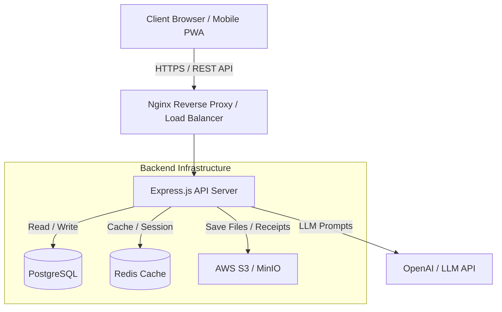

# Arsitektur Sistem (ARCHITECTURE.md)
## AI Personal Finance

Dokumen ini menjelaskan arsitektur tingkat tinggi (high-level architecture) untuk aplikasi AI Personal Finance.

### 1. High-Level System Architecture

Aplikasi ini menggunakan arsitektur *Client-Server* berbasis *Microservices / Modular Monolith* dengan pemisahan tugas yang jelas antara Frontend, Backend, Database, dan Layanan AI Eksternal.



### 2. Komponen Utama

*   **Frontend (React.js + Vite):**
    *   Bertanggung jawab atas UI/UX (menggunakan TailwindCSS + Shadcn UI).
    *   Manajemen state menggunakan TanStack Query untuk caching data API di sisi klien dan Zustand/Context untuk state global.
*   **Backend (Express.js):**
    *   Menyediakan RESTful API.
    *   Menerapkan *Clean Architecture* (Route -> Controller -> Service -> Repository).
    *   Mengelola autentikasi berbasis JWT (JSON Web Tokens).
*   **Database (PostgreSQL):**
    *   Penyimpanan relasional utama (ACID compliant) untuk User, Transaksi, Budget, dan Entitas finansial lainnya.
*   **Cache (Redis):**
    *   Caching respons API yang sering diakses (seperti *Dashboard Summary*).
    *   Manajemen *Rate Limiting* dan antrean (*queue*) untuk tugas berat (misal: analisis riwayat transaksi).
*   **AI Engine (OpenAI GPT / LangChain):**
    *   Menerima prompt konteks finansial pengguna yang sudah dianonimkan (tanpa PII sensitif) untuk menghasilkan *insight*, *financial score*, dan *budgeting recommendations*.

### 3. Backend Folder Structure (Clean Architecture Pattern)
```text
src/
 ├── config/           # Konfigurasi database, env, redis
 ├── controllers/      # Menangani request & response HTTP
 ├── middlewares/      # Auth, Error handler, Validator, Rate limiter
 ├── models/           # Skema Prisma / ORM Models
 ├── routes/           # Definisi endpoint API
 ├── services/         # Business logic (AI processing, kalkulasi finansial)
 ├── repositories/     # Abstraksi akses database (Query builder)
 ├── utils/            # Helper functions, logger, formatters
 └── app.js            # Entry point aplikasi
```
