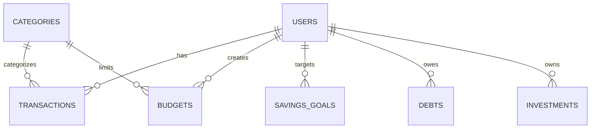

# Struktur Database (DATABASE.md)
## AI Personal Finance

Sistem menggunakan **PostgreSQL** dengan ORM (seperti Prisma atau Sequelize). Berikut adalah rancangan tabel utama beserta relasinya.

### 1. Entity Relationship Diagram (ERD)

### 2. Tabel Utama

#### `users`
Menyimpan profil dan preferensi pengguna.
| Column | Type | Constraints | Description |
| :--- | :--- | :--- | :--- |
| `id` | UUID | PRIMARY KEY | ID unik pengguna |
| `email` | VARCHAR | UNIQUE, NOT NULL | Email login |
| `password_hash` | VARCHAR | NOT NULL | Hash kata sandi |
| `name` | VARCHAR | NOT NULL | Nama lengkap |
| `profession` | VARCHAR | NULL | Pekerjaan (cth: Karyawan Swasta) |
| `income_range` | DECIMAL | NULL | Estimasi pendapatan bulanan |
| `risk_profile` | VARCHAR | NULL | Konservatif, Moderat, Agresif |
| `financial_score` | INT | DEFAULT 0 | Skor finansial (dihitung AI) |
| `created_at` | TIMESTAMP | DEFAULT NOW() | - |

#### `categories`
Kategori default maupun kustom untuk pengeluaran dan pemasukan.
| Column | Type | Constraints | Description |
| :--- | :--- | :--- | :--- |
| `id` | UUID | PRIMARY KEY | ID unik |
| `user_id` | UUID | FOREIGN KEY, NULL| Jika NULL, berarti default kategori sistem |
| `name` | VARCHAR | NOT NULL | Nama (Food, Transport, Salary) |
| `type` | ENUM | NOT NULL | `INCOME` atau `EXPENSE` |
| `icon` | VARCHAR | NULL | URL / nama icon |

#### `transactions`
Mencatat seluruh arus kas pengguna.
| Column | Type | Constraints | Description |
| :--- | :--- | :--- | :--- |
| `id` | UUID | PRIMARY KEY | ID transaksi |
| `user_id` | UUID | FOREIGN KEY | Pemilik transaksi |
| `category_id` | UUID | FOREIGN KEY | Kategori |
| `amount` | DECIMAL | NOT NULL | Nominal uang |
| `date` | DATE | NOT NULL | Tanggal transaksi |
| `description`| TEXT | NULL | Catatan tambahan |
| `receipt_url`| VARCHAR | NULL | URL lampiran struk/bukti |
| `is_recurring`| BOOLEAN | DEFAULT FALSE | Status berulang |

#### `budgets`
Perencanaan pengeluaran bulanan.
| Column | Type | Constraints | Description |
| :--- | :--- | :--- | :--- |
| `id` | UUID | PRIMARY KEY | ID budget |
| `user_id` | UUID | FOREIGN KEY | Pemilik budget |
| `category_id` | UUID | FOREIGN KEY | Kategori yang dibatasi |
| `amount_limit`| DECIMAL | NOT NULL | Batas anggaran |
| `month_year` | DATE | NOT NULL | Bulan dan tahun (format yyyy-mm-01) |

#### `savings_goals`
Target tabungan spesifik pengguna.
| Column | Type | Constraints | Description |
| :--- | :--- | :--- | :--- |
| `id` | UUID | PRIMARY KEY | - |
| `user_id` | UUID | FOREIGN KEY | - |
| `name` | VARCHAR | NOT NULL | Contoh: "Menikah", "Beli Rumah" |
| `target_amount`| DECIMAL | NOT NULL | Target akhir |
| `current_amount`| DECIMAL | DEFAULT 0 | Terkumpul saat ini |
| `deadline` | DATE | NULL | Tenggat waktu |
| `status` | VARCHAR | DEFAULT 'ON_TRACK'| Status progres |

#### `debts`
Manajemen hutang.
| Column | Type | Constraints | Description |
| :--- | :--- | :--- | :--- |
| `id` | UUID | PRIMARY KEY | - |
| `user_id` | UUID | FOREIGN KEY | - |
| `lender_name`| VARCHAR | NOT NULL | Nama pemberi pinjaman/Bank |
| `total_amount`| DECIMAL | NOT NULL | Total pinjaman awal |
| `remaining` | DECIMAL | NOT NULL | Sisa pokok pinjaman |
| `interest_rate`| DECIMAL | NULL | Suku bunga (%) |
| `due_date` | DATE | NULL | Jatuh tempo bulanan |
